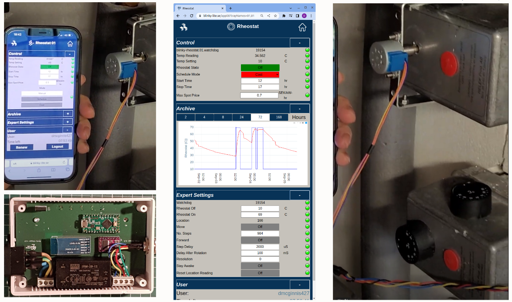

# Blinky Rheostat Tray
Many old heating systems use manual dials to control the temperature or the flow  so it is not possible to interface a spot price device directly to an old heating system. Replacing the entire heating system just because the heating system is manually controlled would be very wasteful . Even just replacing the heating elements could cause damage to the old heating system. 

With Blinky-Rheostat, a small stepper motor is placed on the knob stem. This stepper motor is directly controlled with [Blinky Rheostat Cube](https://github.com/blinky-lite-energy-exchange/blinky-rheostat-cube). The Blinky Rheostat cube can be remotely controlled via a Blinky-Rheostat tray which has access to the electric spot price and can talk and be controlled with an web app on the Blinky-Lite application box. 

This tray receives user input and the spot price from the Blinky-Lite application box server and uses the Blinky-Bus interface to communicate serially with the cube. The serial communication in this tray is done over Bluetooth. The tray code is derived from the [Blinky-Bus tray](https://github.com/Blinky-Lite-Exchange/blinky-bus-tray) project

 
